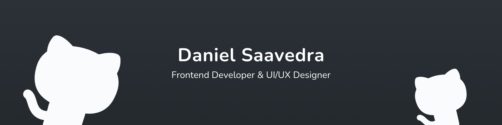

<h2>Hi I'm Daniel 👋</h2>

---

Specialised in frontend development. My main goal is to create a better user experience for everyone.

Here you'll find a collection of my repositories, contributions and experiencies about software development.

 

    
    
    
    
    

